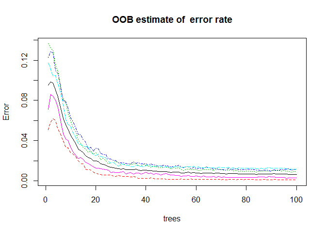

# Prediction Assignment Writeup
Bosah Chude  
Sunday, November 23, 2014  
## Executive Summary

The goal of this project is to predict the manner in which they did the exercise. This is the "classe" variable in the training set.

After building the model, I apply cross validation to determine the expected out of sample error and other relevant statistical qualifier. 

The data was gotten from here: http://groupware.les.inf.puc-rio.br/har

## Pre Processing

Downloading and saving data.


```r
#Download Data
if (!file.exists("pml-training.csv")) {
     
     fileTrain <- "https://d396qusza40orc.cloudfront.net/predmachlearn/pml-training.csv"
     fileTest <- "https://d396qusza40orc.cloudfront.net/predmachlearn/pml-testing.csv"
     
     download.file(fileTrain, "pml-training.csv", method="curl")
     download.file(fileTest, "pml-testing.csv", method="curl")
}
```

Setting the seed to ensure *reproducubility* and loading required libraries.


```r
set.seed(125)
library(randomForest)
library(caret)
```


## Data Processing

The steps in this section involve formatting the data and removing unnecessary columns that are filled with NAs.

All columns with more than 90% NAs are dropped from the training set


```r
#Import the training data
trainingData <- read.csv("pml-training.csv", na.strings=c("NA", "", "#DIV/0!", " "))
trainingData <- trainingData[,8:160]

#Drop all columns with more than 10% NAs
trainingData <- trainingData[,colSums(is.na(trainingData)) < (nrow(trainingData) * 0.9)]

#Further partition the data
inTrain <- createDataPartition(y = trainingData$classe, p = 0.7, list = FALSE)
verificationData <- trainingData[-inTrain,]
trainingData <- trainingData[inTrain,]

#Pull the testing data
testingData <- read.csv("pml-testing.csv", na.strings=c("NA", "", "#DIV/0!", " "))
testingData <- testingData[, 8:160]

#Columns that would be used
names(trainingData)
```

```
##  [1] "roll_belt"            "pitch_belt"           "yaw_belt"            
##  [4] "total_accel_belt"     "gyros_belt_x"         "gyros_belt_y"        
##  [7] "gyros_belt_z"         "accel_belt_x"         "accel_belt_y"        
## [10] "accel_belt_z"         "magnet_belt_x"        "magnet_belt_y"       
## [13] "magnet_belt_z"        "roll_arm"             "pitch_arm"           
## [16] "yaw_arm"              "total_accel_arm"      "gyros_arm_x"         
## [19] "gyros_arm_y"          "gyros_arm_z"          "accel_arm_x"         
## [22] "accel_arm_y"          "accel_arm_z"          "magnet_arm_x"        
## [25] "magnet_arm_y"         "magnet_arm_z"         "roll_dumbbell"       
## [28] "pitch_dumbbell"       "yaw_dumbbell"         "total_accel_dumbbell"
## [31] "gyros_dumbbell_x"     "gyros_dumbbell_y"     "gyros_dumbbell_z"    
## [34] "accel_dumbbell_x"     "accel_dumbbell_y"     "accel_dumbbell_z"    
## [37] "magnet_dumbbell_x"    "magnet_dumbbell_y"    "magnet_dumbbell_z"   
## [40] "roll_forearm"         "pitch_forearm"        "yaw_forearm"         
## [43] "total_accel_forearm"  "gyros_forearm_x"      "gyros_forearm_y"     
## [46] "gyros_forearm_z"      "accel_forearm_x"      "accel_forearm_y"     
## [49] "accel_forearm_z"      "magnet_forearm_x"     "magnet_forearm_y"    
## [52] "magnet_forearm_z"     "classe"
```

## Modelling

The model of choice is "Random Forest" this is due to its documented accuracy in classification problems like these.


```r
#Fit the model
modelFit <- randomForest(classe ~ ., data = trainingData, ntree = 100)

#Plot of error rate vs trees
plot(modelFit, main = "OOB estimate of  error rate")
```

 

```r
#Model Summary
modelFit
```

```
## 
## Call:
##  randomForest(formula = classe ~ ., data = trainingData, ntree = 100) 
##                Type of random forest: classification
##                      Number of trees: 100
## No. of variables tried at each split: 7
## 
##         OOB estimate of  error rate: 0.65%
## Confusion matrix:
##      A    B    C    D    E class.error
## A 3902    4    0    0    0 0.001024066
## B   13 2634   11    0    0 0.009029345
## C    1   20 2368    7    0 0.011686144
## D    0    0   24 2226    2 0.011545293
## E    0    0    1    6 2518 0.002772277
```

The model has an estimated out of sample error of 0.54, this means it is very effective.

## Cross Validation

Using the model to predict on the test data set.

```r
#Predict new values
validationValues <- predict(modelFit, newdata = verificationData)

#Display detailed result summary
confusionMatrix(verificationData$classe, validationValues)
```

```
## Confusion Matrix and Statistics
## 
##           Reference
## Prediction    A    B    C    D    E
##          A 1673    0    0    1    0
##          B    4 1132    3    0    0
##          C    0    9 1016    1    0
##          D    0    0   12  951    1
##          E    0    0    3    2 1077
## 
## Overall Statistics
##                                           
##                Accuracy : 0.9939          
##                  95% CI : (0.9915, 0.9957)
##     No Information Rate : 0.285           
##     P-Value [Acc > NIR] : < 2.2e-16       
##                                           
##                   Kappa : 0.9923          
##  Mcnemar's Test P-Value : NA              
## 
## Statistics by Class:
## 
##                      Class: A Class: B Class: C Class: D Class: E
## Sensitivity            0.9976   0.9921   0.9826   0.9958   0.9991
## Specificity            0.9998   0.9985   0.9979   0.9974   0.9990
## Pos Pred Value         0.9994   0.9939   0.9903   0.9865   0.9954
## Neg Pred Value         0.9991   0.9981   0.9963   0.9992   0.9998
## Prevalence             0.2850   0.1939   0.1757   0.1623   0.1832
## Detection Rate         0.2843   0.1924   0.1726   0.1616   0.1830
## Detection Prevalence   0.2845   0.1935   0.1743   0.1638   0.1839
## Balanced Accuracy      0.9987   0.9953   0.9903   0.9966   0.9990
```

## Testing

Predicting on the supplied test set.


```r
predictedValues <- predict(modelFit, newdata = testingData)

#All twenty predicted values
predictedValues
```

```
##  1  2  3  4  5  6  7  8  9 10 11 12 13 14 15 16 17 18 19 20 
##  B  A  B  A  A  E  D  B  A  A  B  C  B  A  E  E  A  B  B  B 
## Levels: A B C D E
```

## Summary

The model is very efficient with an approximate 99% accuracy level. 
